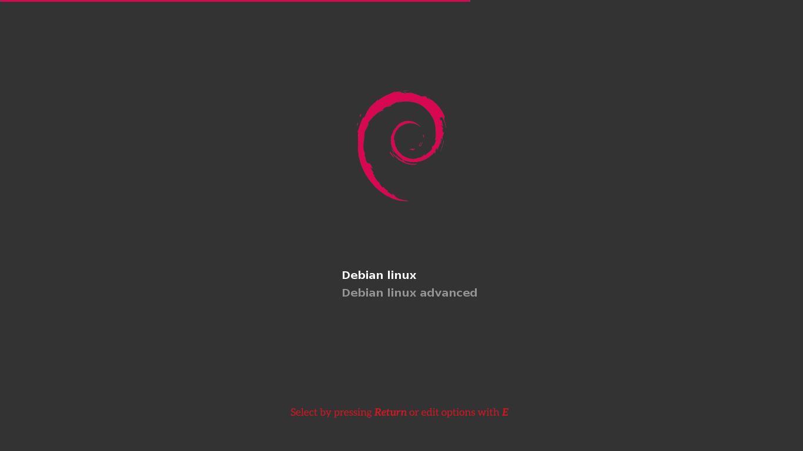

# Debian-Silence GRUB2 theme

Um tema Flat inspirado no Arch-Silence.

1 - use o scrip install.sh
2 - adicione a linha > GRUB_THEME="/boot/grub/themes/debian-silence/theme.txt" em /etc/default/grub
3 - no terminal como ROOT execute update-grub ou grub-mkconfig -o /boot/grub/grub.cfg

## Font

A fonte no menu de inicialização não pode ser alterada por causa do GRUB.

O GRUB tem uma ferramenta de conversão de ttf para o seu próprio formato, mas este formato codifica cada pixel com 1 bit
O que torna completamente inútil, uma vez que não há praticamente nenhuma fonte que é legível em uma baixa profundidade de bits.

## License

Se não for explicitamente indicado o contrário, todos os arquivos neste projeto são distribuídos sob a [GNU General Public License](./COPYING).

## Author
Filippo Ghibellini

## Modificado por 
Isaias Rosa
@abraaorosa